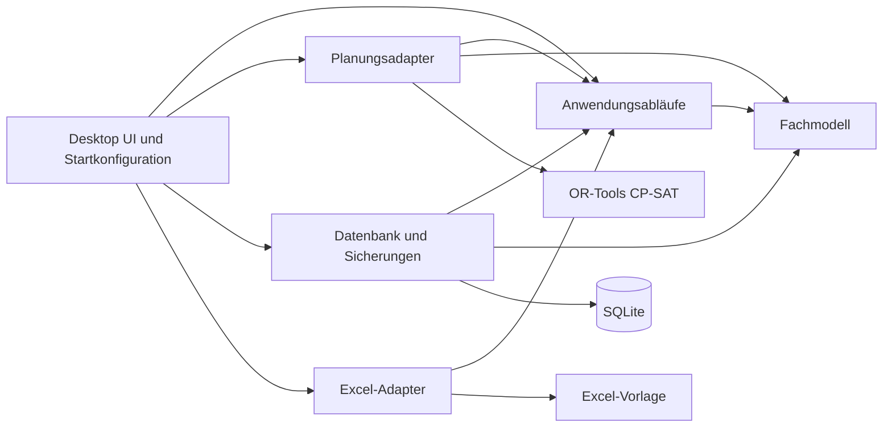

# Architektur der Salztal-Dienstplanung

Status: Abgenommen am 2026-09-13

Stand: 2026-09-13

## Zweck

Nach seiner Abnahme legt dieses Dokument die technische Grundarchitektur der Anwendung verbindlich fest. Es beschreibt Grenzen und Verantwortlichkeiten, aber noch keine konkrete Implementierung einzelner Fachsysteme.

Fachliche Grundlage ist `GRUNDLAGEN_FRAGEN_UND_ENTSCHEIDUNGEN.md`. Die begründete Technologieauswahl und ihre Primärquellen stehen in `docs/decisions/ARCHITECTURE_PROPOSAL.md`.

## Architekturziele

Die Architektur muss:

- eine klassische, vollständig offline nutzbare Windows-11-App ermöglichen,
- eine portable Auslieferung als selbstständigen `win-x64`-Ordner unterstützen,
- die Planungsregeln unabhängig von Oberfläche und Datenbank testbar halten,
- zwingende Regeln unverletzbar behandeln,
- trotz nicht besetzbarer Dienste einen brauchbaren Restplan erzeugen,
- Konflikte fachlich verständlich erklären,
- manuelle Änderungen ohne ungefragte Neugenerierung unterstützen,
- abgenommene Planversionen unveränderlich erhalten,
- die spätere Excel-Vorlage exakt und überprüfbar befüllen,
- neue Einsatzorte, Dienste und Regeln ohne grundlegenden Umbau zulassen,
- echte Mitarbeiter- und Plandaten vollständig aus Git heraushalten.

## Verbindlicher Technologierahmen

| Bereich | Entscheidung | Status |
|---|---|---|
| Zielplattform | Windows 11 x64 | verbindlich |
| Sprache und Laufzeit | C# mit .NET 10 LTS | verbindlich |
| Desktop-Oberfläche | WPF mit XAML | verbindlich |
| UI-Muster | MVVM mit `CommunityToolkit.Mvvm` | verbindlich |
| Lokale Datenbank | SQLite mit Entity Framework Core | verbindlich |
| Planungsengine | Google OR-Tools CP-SAT hinter eigener Schnittstelle | verbindlich |
| Excel-Verarbeitung | eigene Schnittstelle; ClosedXML ist erster Kandidat | Bibliothek erst nach Vorlagentest endgültig |
| Portable Ausgabe | selbstständiger `win-x64`-Ordner als ZIP | verbindliches erstes Ziel |
| Ein-Datei-Ausgabe | nur nach erfolgreichem Machbarkeitstest | offen |
| Installer | nur falls Voraussetzungen nicht portabel mitgeliefert werden können | erlaubter Rückfall |
| Netzwerk und Cloud | keine Nutzung im App-Betrieb | verbindlich |

Windows 10, weitere Betriebssysteme und 32-Bit-Windows gehören nicht zum Zielumfang.

## Gesamtaufbau



Der Desktop-Startpunkt verbindet die Module miteinander. Fachlogik darf jedoch weder WPF noch SQLite, OR-Tools oder eine Excel-Bibliothek kennen.

## Vorgesehene Projektmodule

Die Namen werden beim späteren Grundgerüst verwendet, sofern dessen Teil-Roadmap keine begründete Korrektur vorsieht.

### `Salztal.Dienstplanung.Domain`

Enthält das reine Fachmodell und fachliche Prüfungen:

- Mitarbeiter,
- Arbeitszeitmodelle,
- Qualifikationen und Einsatzfreigaben,
- Einsatzorte,
- Diensttypen und Doppeldienste,
- Verfügbarkeiten und Abwesenheiten,
- Personal- und Schichtbedarf,
- zwingende und weiche Regeln,
- Plan, Zuweisung, Konflikt und Planversion,
- später Über- und Minusstunden.

Dieses Modul besitzt keine Abhängigkeit zu anderen Projektmodulen oder technischen Bibliotheken.

### `Salztal.Dienstplanung.Application`

Enthält die Anwendungsabläufe und technischen Schnittstellen:

- Stammdaten verwalten,
- Verfügbarkeit für einen Zeitraum festlegen,
- Plan erzeugen,
- strukturierte Planungskonflikte in verständliche deutsche Meldungen übersetzen,
- Plan manuell bearbeiten und speichern,
- einzelne Zuweisungen sperren,
- Plan abnehmen und erneut öffnen,
- frühere Planversionen anzeigen und wiederherstellen,
- abgenommenen Plan exportieren,
- Sicherung und Wiederherstellung auslösen.

Das Modul koordiniert das Fachmodell. Es enthält keine WPF-Fenster, Datenbankabfragen, OR-Tools-Aufrufe oder Excel-Zellzugriffe.

Die Anwendungsschicht besitzt außerdem die unveränderlichen Ein- und Ausgabeverträge für Planung und Export. Technische Module erhalten dadurch fertige Momentaufnahmen und niemals einen `DbContext`, eine Datenbankabfrage oder veränderliche UI-Objekte.

### `Salztal.Dienstplanung.Planning`

Enthält die technische Umsetzung der automatischen Planung:

- Übersetzung des Fachmodells in ein CP-SAT-Modell,
- hierarchische Optimierung der Ziele,
- feste und dokumentierte Solver-Einstellungen,
- Rückübersetzung in einen fachlichen Plan,
- Diagnose unbesetzter Dienste,
- strukturierte fachliche Konfliktdaten für verständliche Meldungen.

OR-Tools bleibt vollständig in diesem Modul gekapselt. Das Modul liefert keine fertig formulierten deutschen Oberflächentexte.

### `Salztal.Dienstplanung.Infrastructure`

Enthält lokale technische Dienste:

- Entity Framework Core und SQLite,
- Datenbankkonfiguration und Migrationen,
- Implementierungen der Speicher-Schnittstellen,
- lokale automatische Sicherungen,
- Wiederherstellung,
- Dateisystem und technische Protokollierung.

Diese Verantwortungen bleiben innerhalb des Projekts in den Bereichen `Persistence`, `Backup`, `FileSystem` und `Logging` getrennt. Sie verwenden eigene Schnittstellen und dürfen nicht über interne Abkürzungen voneinander abhängig werden. Erst wenn ein Bereich unabhängig wächst oder eine eigene externe Bibliothek nach außen abschirmen muss, wird er über eine abgenommene Architekturänderung in ein eigenes Projekt ausgelagert.

### `Salztal.Dienstplanung.Excel`

Enthält ausschließlich die Excel-Verarbeitung:

- Vorlagendatei prüfen,
- eine Arbeitskopie der Vorlage erzeugen,
- ausschließlich freigegebene Felder befüllen,
- Ausgabedatei technisch validieren,
- Exportfehler verständlich zurückgeben.

ClosedXML oder das Open XML SDK dürfen nur in diesem Modul verwendet werden. Das Modul erhält eine unveränderliche Exportmomentaufnahme aus `Application`; es lädt weder Pläne noch Mitarbeiter selbst aus der Datenbank.

### `Salztal.Dienstplanung.Desktop`

Enthält:

- WPF-Anwendung und XAML,
- Ansichten und ViewModels,
- deutsche sichtbare Texte,
- Navigation und Dialoge,
- Zusammenbau der konkreten Module beim Programmstart.

Fenster und ViewModels greifen nur über die Anwendungsschicht auf Funktionen zu. Konkrete technische Adapter dürfen ausschließlich im klar abgegrenzten Start- beziehungsweise `Composition`-Bereich des Desktop-Projekts referenziert werden.

### Testprojekte

Für Domain, Application, Planning, Infrastructure und Excel werden getrennte Testprojekte vorgesehen. Ein zusätzliches Architektur-Testprojekt erzwingt die Modulgrenzen. UI-Tests werden auf wenige wichtige Bedienabläufe begrenzt; Fachregeln gehören nicht in UI-Tests.

## Abhängigkeitsregeln

1. `Domain` kennt kein anderes Projektmodul.
2. `Application` darf nur `Domain` verwenden.
3. `Planning` und `Infrastructure` implementieren Schnittstellen aus `Application` und dürfen das Fachmodell verwenden.
4. `Excel` erhält ein von `Application` definiertes Exportmodell und greift nicht direkt auf Datenbank oder UI zu.
5. Der `Composition`-Bereich in `Desktop` ist der einzige Ort, der konkrete technische Implementierungen zusammenstellt.
6. Fenster und ViewModels dürfen nur `Application`, UI-eigene Typen und bewusst freigegebene unveränderliche Anzeigemodelle verwenden.
7. `Desktop` enthält keine Planungs-, Datenbank- oder Excel-Fachlogik.
8. Ein technisches Modul darf kein anderes technisches Modul direkt voraussetzen.
9. Zirkuläre Projektabhängigkeiten sind untersagt.
10. Externe Bibliotheken werden nur im jeweils zuständigen Modul referenziert.
11. Diese Regeln werden durch automatisierte Architekturtests geprüft und nicht nur durch Konvention erwartet.

## Eine einzige fachliche Regelquelle

Jede Planungsregel wird genau einmal als unveränderliche fachliche Regeldefinition in `Domain` beschrieben. Sie enthält mindestens:

- eine stabile Regelkennung,
- Regelart und Geltungsbereich,
- zwingend oder weich,
- bei weichen Regeln die Priorität hoch, mittel oder niedrig,
- fachliche Parameter,
- einen kurzen neutralen Beschreibungsschlüssel.

`Application`, manuelle Planprüfung, Konfliktdiagnose und `Planning` verwenden dieselbe Regeldefinition. Zahlenwerte, Schwellen oder Ausnahmen dürfen nicht ein zweites Mal in ViewModels, Datenbankabfragen oder OR-Tools-Adaptern fest codiert werden.

`Planning` besitzt für jede unterstützte Regelart genau eine technische Übersetzung in Solver-Bedingungen oder Optimierungsziele. Eine unbekannte oder noch nicht übersetzte Regel blockiert die Generierung mit einer verständlichen Meldung; sie darf niemals stillschweigend ignoriert werden.

Für jede Regelart werden gemeinsame Beispielszenarien festgelegt. Dieselben Fälle prüfen sowohl die fachliche Bewertung eines vorhandenen Plans als auch die vom Solver erzeugte Planung. Dadurch wird erkannt, wenn fachliche Prüfung und technische Übersetzung auseinanderlaufen.

## Unveränderliche Modulübergaben

Planungs- und Excel-Adapter arbeiten ausschließlich mit ausdrücklich definierten Momentaufnahmen:

- `PlanningRequest` enthält alle für einen Planungslauf benötigten Daten.
- `PlanningResult` enthält Planvorschlag, Ergebnisstatus, Zielerfüllung und strukturierte Konflikte.
- `ApprovedPlanExport` enthält ausschließlich die für einen abgenommenen Excel-Export benötigten Daten.
- `ExportResult` enthält Erfolg, Zieldatei oder strukturierte Fehler.

Die genauen Typnamen dürfen in der späteren Teil-Roadmap begründet angepasst werden; die Grenze selbst ist verbindlich.

Über Modulgrenzen werden nicht weitergegeben:

- `DbContext`, `IQueryable` oder andere verzögert ausgeführte Datenbankabfragen,
- veränderliche Entity-Framework-Objekte,
- WPF-Controls, ViewModels oder Dispatcher-Objekte,
- OR-Tools-Variablen oder Solver-Objekte,
- ClosedXML- oder Open-XML-Objekte.

Planungs- und Exportadapter dürfen keine zusätzlichen Daten selbst nachladen. `Application` erstellt vor dem Aufruf eine vollständige, konsistente Momentaufnahme.

## Fachliche Modellgrenzen

### Mitarbeiter und Arbeitsmodell

Ein Mitarbeiter ist nicht selbst ein „Mitarbeitertyp“. Folgende Informationen bleiben getrennt kombinierbar:

- Person und Anzeigename,
- Wochenstunden beziehungsweise Arbeitszeitmodell,
- Qualifikationen,
- zulässige Einsatzorte,
- zulässige Diensttypen,
- individuelle Verfügbarkeiten und Abwesenheiten.

Dadurch können neue Kombinationen angelegt werden, ohne für jede Kombination einen neuen festen Typ programmieren zu müssen. Vordefinierte Profile dürfen später die Eingabe erleichtern, bleiben aber nur Vorlagen für diese getrennten Eigenschaften.

### Zeitdarstellung

- Kalendertage werden ohne Uhrzeit gespeichert.
- Dienstzeiten werden als lokale Uhrzeiten und Arbeitsdauer abgebildet.
- Eine Dauer wird als ganze Minuten gespeichert und berechnet.
- Ein Doppeldienst besitzt zwei getrennte Dienstabschnitte und eine unbezahlte Unterbrechung.
- Der Einsatzort gehört zu jedem Dienstabschnitt; beide Teile eines Doppeldienstes müssen dieselbe Restaurant-Zuordnung besitzen.
- Falls später Dienste über Mitternacht benötigt werden, muss diese Regel vor Umsetzung ausdrücklich ergänzt werden.

### Bedarf

Ein Bedarf bezeichnet eine feste Zahl benötigter Plätze für:

- einen Einsatzort,
- einen Kalendertag,
- einen vorher definierten Diensttyp.

Die benötigten Stunden werden aus Anzahl der Plätze mal bezahlter Dauer des Diensttyps berechnet. Ein unabhängiger zweiter Stundenwert wird nicht eingegeben. Überbesetzung ist nicht zulässig.

## Planungsarchitektur

### Eingabe

Die Planungsengine erhält eine unveränderliche Momentaufnahme aller für den Zeitraum benötigten Daten:

- Planungszeitraum,
- verfügbare Mitarbeiter und ihre Eigenschaften,
- Abwesenheiten und Verfügbarkeiten,
- Dienste und Bedarfe,
- relevante Historie,
- zwingende Regeln,
- priorisierte weiche Regeln,
- gesperrte Zuweisungen,
- gegebenenfalls aktuelle Stundenstände.

Während einer Berechnung liest die Engine nicht erneut aus der Datenbank. Dadurch bleibt ein Lauf nachvollziehbar und testbar.

### Besetzte und unbesetzte Plätze

Jeder benötigte Platz wird genau einmal abgebildet:

- durch einen zulässigen Mitarbeiter oder
- als ausdrücklich unbesetzt.

Es gibt keine zusätzlichen Plätze. So kann keine automatische Überbesetzung entstehen. Die Möglichkeit „unbesetzt“ verhindert zugleich, dass die gesamte Generierung wegen Personalmangels scheitert.

### Zwingende Regeln

Zwingende Regeln werden als unverletzbare Bedingungen modelliert. Eine Person wird niemals automatisch so eingeplant, dass eine zwingende Regel verletzt wird. Ist keine zulässige Person vorhanden, bleibt der Platz unbesetzt.

Gesperrte Zuweisungen sind für eine Neugenerierung ebenfalls zwingend. Widerspricht eine neue Eingabe einer Sperre, startet keine irreführende Planung; die App meldet den Widerspruch konkret.

### Priorisierte Ziele

Die Optimierung erfolgt hierarchisch:

1. zwingende Regeln einhalten,
2. Zahl unbesetzter Plätze minimieren,
3. weiche Regeln mit Priorität hoch optimieren,
4. weiche Regeln mit Priorität mittel optimieren,
5. weiche Regeln mit Priorität niedrig optimieren,
6. bei ansonsten gleichwertigen Lösungen eine stabile und nachvollziehbare Verteilung bevorzugen.

Die Stufen werden durch getrennte Optimierungsläufe oder nachweisbar dominante Grenzen abgesichert. Viele niedrige Wünsche dürfen zusammen niemals einen höheren Wunsch überstimmen.

### Wiederholbarkeit und Laufzeit

- Solver-Version und Einstellungen werden mit dem Planungsergebnis gespeichert.
- Zufallsstartwert und Parallelität werden für automatisierte Tests festgelegt.
- Produktive Läufe erhalten eine konfigurierbare Zeitgrenze.
- Die App unterscheidet zwischen optimal, zulässig aber noch nicht nachweislich optimal und technisch abgebrochen.
- Ein technisch abgebrochener Lauf ersetzt keinen bestehenden Plan ohne bewusste Bestätigung.

### Konflikterklärung

Jede an den Solver übertragene Bedingung erhält eine fachliche Kennung. Diese enthält mindestens Regel, Tag, Dienst, Einsatzort und betroffene Mitarbeiter beziehungsweise Mitarbeitergruppe.

Für einen unbesetzten Platz führt die Diagnose kontrollierte Prüfungen durch und liefert:

- den nicht besetzten Dienst,
- den konkreten Bedarf,
- ausgeschlossene Personen und die jeweils entscheidenden Gründe,
- betroffene Wünsche und Prioritäten,
- mögliche Änderungen, die eine Besetzung erlauben könnten.

Das Planungsergebnis enthält dafür strukturierte Daten mit stabilen Ursache- und Lösungscodes sowie den notwendigen fachlichen Parametern. Es enthält keine zusammengesetzten deutschen Sätze.

Eine klar abgegrenzte Konfliktdarstellung in `Application` übersetzt diese Daten in verständliche deutsche Meldungen. `Desktop` stellt die fertigen Meldungen dar, entscheidet aber nicht selbst über Ursachen oder Lösungsmöglichkeiten. Dadurch bleiben Diagnose, Sprache und Anzeige getrennt testbar.

Lösungsvorschläge sind Hinweise. Sie verändern niemals automatisch Stammdaten, Abwesenheiten, Regeln oder Sperren.

## Wichtige Datenflüsse

### Automatische Planerzeugung

1. `Desktop` fordert die Generierung bei `Application` an.
2. `Application` prüft Eingaben und lädt eine konsistente Planungsmomentaufnahme.
3. `Planning` erzeugt und löst das Modell.
4. `Planning` liefert Plan, offene Plätze, Zielerfüllung und Konfliktdaten.
5. `Application` speichert den neuen Entwurf gemeinsam mit den verwendeten Eingaben.
6. `Desktop` zeigt Plan und Konflikte an.

### Manuelle Bearbeitung

1. Die Service-Leitung öffnet ausdrücklich den Bearbeitungsmodus.
2. Die Oberfläche sendet Änderungen an `Application`.
3. Fachliche Prüfungen kennzeichnen unzulässige oder bewusst übergangene Einteilungen.
4. Beim Speichern werden Stunden, Bedarf und Konflikte neu berechnet.
5. Es findet keine automatische vollständige Neugenerierung statt.

Die bestätigte manuelle Sonderzuweisung außerhalb einer normalen Einsatzfreigabe ist ein eigener, ausdrücklich zu bestätigender Vorgang. Sie ändert die Einsatzfreigabe in den Stammdaten nicht, bleibt als Warnung sichtbar und ist für die automatische Planerzeugung weiterhin unzulässig.

### Abnahme und erneute Änderung

1. Ein Entwurf wird fachlich geprüft.
2. Bei der Abnahme entsteht eine unveränderliche Planversion mit Zeitpunkt.
3. Nur die aktuell abgenommene Version darf exportiert werden.
4. Eine spätere Änderung erzeugt einen neuen Entwurf auf Basis der abgenommenen Version.
5. Der frühere Stand bleibt unverändert erhalten.
6. Erst eine erneute Abnahme erzeugt eine neue exportierbare Version.

### Excel-Export

1. `Application` prüft, dass eine aktuelle abgenommene Version vorliegt.
2. `Excel` kopiert die unveränderte Vorlage in eine neue Ausgabedatei.
3. Der Plan wird ausschließlich in die festgelegten Bereiche geschrieben.
4. Die Datei wird technisch validiert und geschlossen.
5. Erst danach meldet die App den Export als erfolgreich.

## Speicherung

### Vorgesehene Pfade

- Programmdateien: frei wählbarer entpackter Programmordner
- Datenbank und technische lokale Daten: `%LocalAppData%\Salztal Dienstplanung`
- automatische Sicherungen: standardmäßig ein eigener Unterordner im Windows-Benutzerbereich
- manuelle Sicherungen und Excel-Ausgaben: von der Service-Leitung gewählter Zielordner

Die genauen Pfade werden im Datenhaltungs-System festgelegt und getestet. Programmdateien und veränderliche Benutzerdaten bleiben immer getrennt.

### Datenbankregeln

- Datenänderungen erfolgen über die Anwendungsschicht.
- Zusammengehörige Änderungen werden in einer Transaktion gespeichert.
- Jede Datenbankversion besitzt eine eindeutige Migrationsnummer.
- Vor einer automatischen Migration wird eine konsistente Sicherung erstellt.
- Eine fehlgeschlagene Migration darf die letzte funktionierende Datenbank nicht überschreiben.
- Manuelle Korrekturen an Zeitkonten werden mit altem Wert, neuem Wert, Zeitpunkt und optionalem Grund gespeichert.
- Archivierte Pläne und abgenommene Versionen werden nicht automatisch gelöscht.

## Datensicherung und Wiederherstellung

- Regelmäßige Sicherungen laufen lokal und dürfen die Bedienung nicht blockieren.
- Eine Sicherung enthält Datenbank, Datenbankversion und notwendige App-Metadaten.
- Vor dem Wiederherstellen wird der aktuelle Stand nochmals gesichert.
- Eine Sicherung wird vor Übernahme auf Lesbarkeit und unterstützte Version geprüft.
- Aufbewahrungsanzahl und Intervall werden später als eigene Regeln definiert.
- Fehler bei einer Sicherung werden sichtbar gemeldet und nicht nur protokolliert.

## Excel-Strategie

Die Excel-Vorlage ist fachliche Wahrheit für den Export. Weder WPF-Ansicht noch internes Datenmodell dürfen ihr Format stillschweigend verändern.

Vor Festlegung der konkreten Bibliothek sind folgende Vorlagentests zwingend:

- Datei öffnen und unverändert erneut speichern,
- Druckbereich und Seitenformat vergleichen,
- Spaltenbreiten, Zeilenhöhen, Schrift, Rahmen und Farben vergleichen,
- verbundene Zellen und ausgeblendete Bereiche vergleichen,
- Formeln und benannte Bereiche vergleichen,
- drei Wochen auf einer Seite prüfen,
- Datei in der vorgesehenen Excel-Version öffnen,
- synthetische Testdaten eintragen und das Ergebnis durch die Service-Leitung abnehmen lassen.

ClosedXML wird zuerst geprüft. Falls es Bestandteile nicht zuverlässig erhält, wird das Exportmodul intern auf das Open XML SDK umgestellt. Außerhalb von `Salztal.Dienstplanung.Excel` bleibt dieser Wechsel unsichtbar.

## Oberfläche

- Alle sichtbaren Texte sind deutsch.
- Die Hauptansicht orientiert sich an der Excel-Vorlage: Mitarbeiter in Zeilen, Tage in Spalten.
- Eine zweite Ansicht zeigt die Besetzung je Einsatzort.
- Konflikte erscheinen farblich im Plan und zusätzlich in einer Liste.
- Farbe ist nie der einzige Informationsträger; Text und Symbole erklären denselben Zustand.
- Manuelle Bearbeitung benötigt einen ausdrücklichen Start- und Speichervorgang.
- Zwingende Verstöße werden blockiert; bewusst erlaubte Abweichungen werden bestätigt und sichtbar markiert.
- Lange Planungs- oder Exportvorgänge blockieren die Oberfläche nicht.

Konkrete Bedienabläufe und Gestaltung werden in eigenen UI-Roadmaps festgelegt.

## Datenschutz und Protokollierung

- Die Anwendung kommuniziert im Betrieb nicht über das Netzwerk.
- Echte Mitarbeiter-, Abwesenheits-, Krankheits- und Plandaten bleiben lokal.
- Protokolle enthalten standardmäßig technische Kennungen statt Namen.
- Gesundheits- oder Abwesenheitsgründe werden nicht in technische Protokolle geschrieben.
- Fehlerdialoge nennen die für die Service-Leitung notwendige fachliche Information, aber keine unnötigen internen Daten.
- Git, Tests und Beispieldaten verwenden ausschließlich erfundene Personen und synthetische Pläne.
- Datenbank, Sicherungen und erzeugte Exporte bleiben durch `.gitignore` ausgeschlossen.

## Bereitstellung

Die erste vorgesehene Ausgabe ist:

- Release-Konfiguration,
- Ziel `win-x64`,
- selbstständige .NET-Veröffentlichung,
- vollständiger Ordner als ZIP-Datei,
- Start über eine eindeutig benannte `.exe`,
- keine vorausgesetzte separate .NET-Installation.

OR-Tools verwendet eine native C++-Bibliothek und verlangt laut offizieller Windows-Anleitung die x64-Ausgabe der Microsoft Visual C++ Redistributable. Deshalb gilt:

1. Auf einem sauberen Windows-11-Testsystem wird geprüft, ob der portable Ordner ohne Zusatzinstallation startet.
2. Es wird geprüft, ob die benötigte Laufzeit zulässig und zuverlässig lokal mitgeliefert werden kann.
3. Falls das nicht zuverlässig möglich ist, wird ein kleiner Installer verwendet.
4. „Ohne Installation“ wird erst nach bestandenem Test als erreicht gemeldet.

Eine Ein-Datei-Ausgabe ist ein späteres Komfortziel und kein Abnahmekriterium der ersten funktionsfähigen Version.

## Fehlerbehandlung

- Erwartbare fachliche Probleme werden als verständliche Ergebnisse und nicht als Programmabsturz behandelt.
- Technische Fehler werden mit einer stabilen Fehlerkennung protokolliert.
- Speichern, Abnahme, Wiederherstellung und Export melden erst nach vollständigem Erfolg einen Abschluss.
- Teilweise geschriebene Daten oder Excel-Dateien werden nicht als gültiges Ergebnis angeboten.
- Eine fehlgeschlagene Planung überschreibt keinen vorhandenen Plan.
- Globale, nichtssagende Ausnahmebehandlung ist untersagt.

## Automatisierte Architekturprüfungen

Sobald das App-Grundgerüst angelegt wird, entsteht ein eigenes Architektur-Testprojekt. Es prüft mindestens:

- `Domain` referenziert kein anderes Produktionsprojekt und keine UI-, Datenbank-, Solver- oder Excel-Bibliothek.
- `Application` referenziert außer `Domain` kein anderes Produktionsprojekt.
- OR-Tools-Typen existieren ausschließlich in `Planning`.
- Entity-Framework- und SQLite-Typen existieren ausschließlich in `Infrastructure`.
- ClosedXML- und Open-XML-Typen existieren ausschließlich in `Excel`.
- ViewModels und Fenster referenzieren keine konkreten Typen aus `Planning`, `Infrastructure` oder `Excel`.
- Nur der abgegrenzte `Composition`-Bereich darf konkrete Adapter registrieren und erzeugen.
- Es existieren keine zirkulären Projektabhängigkeiten.
- Modulübergaben enthalten keine verbotenen technischen Typen.

Zusätzlich wird die zulässige Projektreferenzstruktur in den Projektdateien geprüft. Ein Testfehler an einer Architekturgrenze blockiert den Abschluss des jeweiligen Entwicklungsschritts.

## Teststrategie und wahrheitsgemäße Gates

Folgende Nachweise sind getrennt zu führen:

1. Lösung kompiliert.
2. Domain- und Anwendungslogiktests bestehen.
3. Fokusfälle der Planungsengine bestehen.
4. Konflikterklärungen nennen richtige Ursachen und umsetzbare Möglichkeiten.
5. Datenbankmigration und Wiederherstellung bestehen mit Testdaten.
6. Excel-Vorlage besteht technische und visuelle Prüfung.
7. WPF-Bedienabläufe bestehen die vereinbarten UI-Prüfungen.
8. Der selbstständige `win-x64`-Ordner startet auf einem sauberen Windows-11-Testsystem.
9. Die Service-Leitung nimmt den vollständigen Ablauf auf dem Klinikrechner ab.

Ein offenes Gate bleibt offen. Ein lokaler Build ersetzt weder Excel-Abnahme noch portablen Windows-Test oder fachliche Abnahme.

## Geplante Lösungsstruktur

```text
src/
  Salztal.Dienstplanung.Domain/
  Salztal.Dienstplanung.Application/
  Salztal.Dienstplanung.Planning/
  Salztal.Dienstplanung.Infrastructure/
  Salztal.Dienstplanung.Excel/
  Salztal.Dienstplanung.Desktop/
tests/
  Salztal.Dienstplanung.Domain.Tests/
  Salztal.Dienstplanung.Application.Tests/
  Salztal.Dienstplanung.Planning.Tests/
  Salztal.Dienstplanung.Infrastructure.Tests/
  Salztal.Dienstplanung.Excel.Tests/
  Salztal.Dienstplanung.Desktop.Tests/
  Salztal.Dienstplanung.Architecture.Tests/
docs/
  decisions/
  roadmaps/
Service-Leitung/
```

Diese Ordner und Projekte werden erst in einer späteren, ausdrücklich freigegebenen Teil-Roadmap angelegt.

## Erweiterbarkeit

- Neue Einsatzorte sind Daten und keine neuen UI-Sonderfälle.
- Neue Diensttypen werden über das Fachmodell ergänzt.
- Neue Regeln implementieren einen gemeinsamen Regelvertrag und besitzen eigene Tests.
- Die Planungsengine erhält Regeln über fachliche Eingaben statt über hart codierte Abfragen in der Oberfläche.
- Excel-Vorlagenvarianten werden über versionierte Vorlagenbeschreibungen statt über UI-Code behandelt.
- Zeitkonten bleiben ein getrenntes, späteres Modul.
- Mehrbenutzerbetrieb oder Cloud-Synchronisierung wären eine neue Architektur und gehören nicht zur aktuellen Erweiterbarkeit.

## Bewusst nicht Bestandteil der Architektur

- Windows 10 oder andere Betriebssysteme,
- Mehrbenutzerbetrieb,
- Anmeldung und Rollen,
- Cloud-Speicherung oder Synchronisierung,
- mobile Apps,
- PDF-Export,
- automatische Aktualisierung der App,
- konkrete Mitarbeiter-, Dienst- oder Bedarfsregeln,
- konkrete Excel-Zellzuordnungen,
- Zeitkonten in der ersten funktionsfähigen Ausbaustufe.

## Änderungsregel

Eine Änderung an Zielplattform, Laufzeit, UI-Technik, Datenbank, Planungsengine, Modulgrenzen oder Offline-Grenze benötigt:

1. einen dokumentierten Änderungsvorschlag unter `docs/decisions`,
2. Auswirkungen auf bestehende Systeme und Daten,
3. eine eigene Prüfung,
4. ausdrückliche Abnahme,
5. anschließende Aktualisierung von `ARCHITECTURE.md`, Roadmaps, Status und Service-Leitungsdokumentation.
