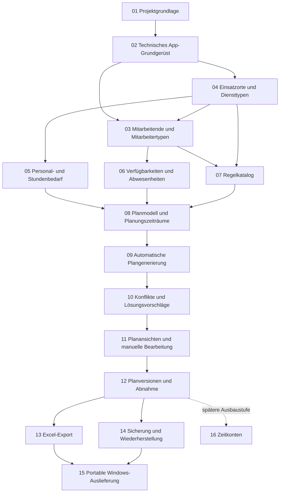

# Master-Roadmap der Salztal-Dienstplanung

Status: Grundfassung abgenommen am 2026-09-13; Systeme 05, 06, 07 und 08 abgeschlossen; System 09 in Umsetzung

Stand: 2026-09-18

## Zweck

Diese Master-Roadmap zeigt die geplanten Systeme der Anwendung, ihre grobe Reihenfolge und ihre wichtigsten Abhängigkeiten. Sie dient der Orientierung und ist keine Umsetzungsfreigabe.

Vor jedem System wird eine eigene kleinschrittige Teil-Roadmap unter `docs/roadmaps` erstellt und abgenommen. Erst danach darf dessen erster Implementierungsschritt beginnen. Technische Einzelheiten und konkrete Fachregeln gehören in diese späteren Teil-Roadmaps, nicht in die Master-Roadmap.

## Verbindliche Grundlagen

- Die fachlichen Grundlagen stehen in `GRUNDLAGEN_FRAGEN_UND_ENTSCHEIDUNGEN.md`.
- Die technischen Grenzen stehen in `ARCHITECTURE.md`.
- Die Qualitätsregeln stehen in `CLEANCODE.md`.
- Die Arbeits- und Abnahmeregeln stehen in `AGENTS.md`.
- Die abgeschlossene Projektgrundlage ist in `docs/roadmaps/completed/S01_PROJECT_FOUNDATION_ROADMAP.md` dokumentiert.
- Konkrete Mitarbeiter-, Dienst-, Bedarfs- und Planungsregeln werden erst in den dafür vorgesehenen Teil-Roadmaps gemeinsam festgelegt.

## Statuszeichen

- `[ ]` noch nicht begonnen
- `[~]` in Bearbeitung oder wartet auf Abnahme
- `[x]` geprüft und ausdrücklich abgenommen
- `[!]` blockiert; der konkrete Grund wird direkt genannt

Ein System wird in dieser Übersicht erst als `[x]` markiert, wenn seine Teil-Roadmap vollständig abgeschlossen und abgenommen wurde.

## Grobe Abhängigkeiten

Der Pfeil zeigt eine notwendige Vorarbeit, aber nicht automatisch eine vollständige zeitliche Sperre. Eine Teil-Roadmap darf vorbereitende Arbeiten anders ordnen, wenn sie die Architekturgrenzen wahrt und die Abweichung begründet abgenommen wird.

## Geplante Systeme

### 01 – Projektgrundlage

Status: `[x]` – abgeschlossen und archiviert am 2026-09-13

Ziel: Fachliche Grundlagen, Architektur, Qualitäts- und Arbeitsregeln sowie wahrheitsgemäße Projektsteuerung fertigstellen.

Teil-Roadmap: `docs/roadmaps/completed/S01_PROJECT_FOUNDATION_ROADMAP.md`

Abhängigkeiten: keine

### 02 – Technisches App-Grundgerüst

Status: `[x]` – abgeschlossen und archiviert am 2026-09-13

Ziel: Die leere Windows-11-Anwendung, Projektmodule, Abhängigkeitsgrenzen, zentrale Paketverwaltung und erste Architekturtests als belastbares Gerüst anlegen.

Teil-Roadmap: `docs/roadmaps/completed/S02_TECHNICAL_APP_SCAFFOLD_ROADMAP.md`

Abhängigkeiten: 01

### 03 – Mitarbeitende, Mitarbeitertypen und Einsatzfreigaben

Status: `[x]` – abgeschlossen und archiviert am 2026-09-14

Ziel: Mitarbeitende mit getrennten Namen, Aktivstatus und genau einem gemeinsam referenzierten Mitarbeitertyp erfassen und lokal speichern. Jeder Typ stellt sein Wochen-Soll sowie reguläre, kontextabhängige und nur vorschlagsfähige Einsatzfreigaben als strukturierte Fachwerte bereit.

Teil-Roadmap: `docs/roadmaps/completed/S03_EMPLOYEES_EMPLOYEE_TYPES_SHIFT_ELIGIBILITY_ROADMAP.md`

Nachtrag: Vor System 06 erweitert dessen abgenommener Vorbereitungsteil die bereits technisch vorbereitete Mitarbeitertypenpflege um drei weitere Starttypen, den `U`-/`K`-Tageswert sowie Anlegen, Bearbeiten und referenzgeschütztes Löschen in einem eigenen Tab. Der historische Abschluss von System 03 bleibt unverändert.

Abhängigkeiten: 02 und 04

### 04 – Einsatzorte, Diensttypen und Doppeldienste

Status: `[x]` – abgeschlossen und archiviert am 2026-09-13

Ziel: Erweiterbare Einsatzorte, normale Diensttypen mit bearbeitbaren Standardzeiten sowie die zusammengesetzten Einsatzmuster für den festen Restaurant-Doppeldienst `D` und den samstäglichen Springer `Spr` als fachliche Grundlage verwalten können.

Teil-Roadmap: `docs/roadmaps/completed/S04_WORK_LOCATIONS_SHIFT_TYPES_SPLIT_SHIFTS_ROADMAP.md`

Abhängigkeiten: 02

### 05 – Personal-, Schicht- und Stundenbedarf

Status: `[x]` – abgeschlossen und archiviert am 2026-09-15

Ziel: Standardbedarfe und datumsbezogene Ausnahmen je Einsatzort und genau einem verlangten Diensttyp mit tatsächlicher Zeit und Personenzahl erfassen; daraus Personen- und Stundenbedarf nachvollziehbar berechnen.

Teil-Roadmap: `docs/roadmaps/completed/S05_STAFFING_DEMAND_ROADMAP.md`

Abhängigkeiten: 04

### 06 – Verfügbarkeiten und Abwesenheiten

Status: `[x]` – vollständig geprüft, ausdrücklich abgenommen und archiviert

Ziel: Vorbereitend Mitarbeitertypen einschließlich Abwesenheits-Tageswert und Einsatzberechtigungen pflegen; anschließend Urlaub `U`, Krankheit `K` und verbindliche rote `X` für konkrete Kalendertage in einer Drei-Wochen-Ansicht erfassen, korrigieren und lokal speichern. Fortbildung, Wunschfrei und zeitliche Einschränkungen gehören nicht zur ersten Fassung.

Teil-Roadmap: `docs/roadmaps/completed/S06_AVAILABILITY_ABSENCE_ROADMAP.md`

Abhängigkeiten: 03

### 07 – Regelkatalog und Prioritäten

Status: `[x]` – vollständig geprüft, ausdrücklich abgenommen und archiviert am 2026-09-16

Ziel: Gemeinsam bestätigte Regeln mit ihrer Wirkung für automatische Generierung und manuelle Bearbeitung als eine zentrale fachliche Quelle abbilden. Dazu gehören nicht übersteuerbare Strukturregeln, automatische Hard Rules, weiche Regeln mit den Prioritäten hoch, mittel und niedrig, der normale Wochenkorridor sowie stabile Bewertungs- und Ursachecodes. Der abgeschlossene Stand enthält in Katalogversion 1 die damals bestätigte nachgelagerte AH-Planung. Der System-09-Nachtrag führt mit Katalogversion 2 die gemeinsame Nicht-AH-/AH-Optimierung ein, ohne die historische Bedeutung der Version 1 umzuschreiben. Der feste Katalog wird nicht in WPF oder SQLite gepflegt.

Teil-Roadmap: `docs/roadmaps/completed/S07_RULE_CATALOG_ROADMAP.md`

Abhängigkeiten: 03, 04, 05 und 06; fachliche Regeln sind bestätigt

### 08 – Planmodell und Planungszeiträume

Status: `[x]` – am 2026-09-16 vollständig geprüft, ausdrücklich abgenommen und archiviert

Ziel: Einen Planungszeitraum aus genau drei vollständigen Montag-bis-Sonntag-Wochen, tatsächliche Dienstzeiten, Zuweisungen, vollständig ungedeckte normale Bedarfsplätze, den bestätigten `Spr`-Teildeckungsfall und einzelne Sperren fachlich und lokal speicherbar machen. Ein bereits gespeicherter Planungszeitraum darf sich nicht mit einem neuen Zeitraum überschneiden. Vorgetragene Typ1-Früh- und Spätdienste können strukturiert als bedarfsneutrale Bürozeit gekennzeichnet werden. Manuelle Zusatzbesetzungen werden unabhängig von freien Bedarfsplätzen modelliert und verändern den Bedarf nicht.

Teil-Roadmap: `docs/roadmaps/completed/S08_SCHEDULE_MODEL_ROADMAP.md`

Abhängigkeiten: 05, 06 und 07

### 09 – Automatische Plangenerierung

Status: `[~]` – technisch funktionsfähiger AG-14F-Ausgangsstand bestätigt; Qualitätsentscheidung nach S09A, S09B und gezielter Optimierung offen

Vorbereitung: Der Fragenkatalog `docs/roadmaps/active/S09_AUTOMATIC_SCHEDULE_GENERATION_QUESTIONS.md` wurde am 2026-09-17 vollständig beantwortet und als Grundlage der Teil-Roadmap bestätigt.

Ziel: Aus den bestätigten Eingaben einen zulässigen bestmöglichen Plan erzeugen, automatische Hard Rules unverletzt lassen, automatische Überbesetzung verhindern und ungedeckte Zeiträume sichtbar offenlassen. Normale Zuweisungen decken einen Bedarfsplatz vollständig; nur der bestätigte `Spr`-Sonderfall erzeugt Teildeckung. Der vor AG-15 geplante Zielstand optimiert Nicht-AH und AH gemeinsam, minimiert bei gleicher Deckung und nach hohen Schutzregeln zuerst `Spr` und `D`, strebt mindestens drei AH-Stunden je Person und Woche an und nähert anschließend alle relativ fair an ihr persönliches Wochenziel an. AG-14A erlaubt weiterhin das bewusste vollständige Verwerfen eines übernommenen automatischen Plans im aktuellen, noch nicht abgenommenen Arbeitsentwurf. Der technisch funktionsfähige Generator bleibt während S09A und S09B unverändert; ein Qualitätsbericht schafft anschließend die Grundlage für einen gesondert geplanten Optimierungs- oder Rückfallschritt. Erst der endgültig vorgesehene Algorithmus durchläuft AG-15.

Teil-Roadmap: `docs/roadmaps/active/S09_AUTOMATIC_SCHEDULE_GENERATION_ROADMAP.md` – abgenommen; AG-01 abgeschlossen

Abhängigkeiten: 08

### 09A – Dienstplan-Oberfläche neu ordnen und Bedienung vereinheitlichen

Status: `[x]` – vollständig geprüft, am 2026-09-18 ausdrücklich abgenommen und archiviert

Ziel: Die vorhandene Dienstplanoberfläche bei unverändertem Generator zugunsten der Drei-Wochen-Planung neu ordnen, Typ1-Dienste direkt am Tagesfeld auswählen, Meldungen platzneutral darstellen und zerstörerische Bestätigungen vereinheitlichen. Die Tabelle gliedert die drei Wochen sichtbar und ordnet Typ1 vor regulären und AH-Personen; der Beginn des AH-Blocks wird hervorgehoben. S09A bleibt ein reiner UI-Zwischenschritt innerhalb des noch offenen Systems 09 und zieht weder Planungsqualitätsbericht noch Konflikterklärung oder allgemeine manuelle Bearbeitung vor.

Teil-Roadmap: `docs/roadmaps/completed/S09A_SCHEDULE_UI_RESTRUCTURING_ROADMAP.md` – UI-01 bis UI-09 vollständig umgesetzt, automatisch geprüft und gemeinsam sichtbar abgenommen

Abhängigkeiten: technisch funktionsfähiger System-09-Ausgangsstand und ausdrückliche Roadmap-Abnahme

### 09B – Planungsqualitätsbericht für den unveränderten Ausgangsstand

Status: `[~]` – Fragenkatalog, Roadmap und QB-01 bis QB-05 abgenommen; QB-06 technisch und vollständig automatisch geprüft; QB-06A freigegeben, QB-06A.1 bis QB-06A.4 abgenommen, QB-06A.5 sichtbar umgesetzt und gezielt geprüft

Ziel: Den unveränderten Generator mit einem Planungsbericht und einem getrennten Generierungsbericht beurteilen. Der Planungsbericht zeigt alle Bedarfe und ihre Deckung, Soll- und geplante Wochenarbeitszeiten sowie Dienstanzahlen je Person und Woche. Der Generierungsbericht bilanziert für jeden erfolgreichen oder erfolglosen Generierungsversuch die tatsächlich erreichten Phasen und vorhandenen strukturierten Fehlerwerte. Damit werden insbesondere die Verteilung von `F` und `S` sowie die Minimierung von `D` messbar. Der Bericht öffnet in einem eigenen nicht-modalen Fenster, das neben dem Dienstplan bedienbar bleibt. S09B enthält noch keine vollständigen personenbezogenen Ursachenanalysen oder Lösungsvorschläge aus System 10 und verändert den Generator fachlich nicht.

Fragenkatalog: `docs/roadmaps/active/S09B_PLANNING_QUALITY_REPORT_QUESTIONS.md` – vollständig beantwortet und konsolidiert

Teil-Roadmap: `docs/roadmaps/active/S09B_PLANNING_QUALITY_REPORT_ROADMAP.md` – abgenommen und um den ausdrücklich freigegebenen QB-06A-Korrekturschritt ergänzt; QB-06A.1 bis QB-06A.4 sind abgenommen, QB-06A.5 ist technisch und gezielt geprüft und wartet auf die sichtbare Abnahme

Abhängigkeiten: 09A und technisch eingefrorener System-09-Ausgangsstand

### 10 – Konflikterklärung und Lösungsvorschläge

Status: `[ ]`

Ziel: Die in S09B neutral dargestellten vollständig gedeckten, im `Spr`-Sonderfall teilweise gedeckten und ungedeckten Bedarfe um kontrollierte Ursachen und hilfreiche, nicht automatisch ausgeführte Lösungsmöglichkeiten ergänzen. Teilweise oder vollständig ungedeckte Bedarfszeiträume, verletzte Planungsregeln, unvollständig prüfbare Regeln und bestätigungspflichtige manuelle Abweichungen werden mit Ursache und Priorität verständlich erklärt. System 10 dupliziert nicht die bereits in S09B bereitgestellte neutrale Bedarfsrechnung.

Teil-Roadmap: vor Beginn anzulegen und abzunehmen

Abhängigkeiten: 07 und vollständig abgeschlossenes System 09 einschließlich 09A und 09B

### 11 – Planansichten, manuelle Bearbeitung und Sperren

Status: `[ ]`

Ziel: Mitarbeitende als Zeilen und Tage als Spalten sowie eine Einsatzortansicht bereitstellen; Pläne bewusst manuell ändern, einzelne Zuweisungen sperren, prüfen und speichern, ohne eine automatische Neugenerierung auszulösen. Nicht übersteuerbare Strukturverletzungen werden blockiert. Übersteuerbare Planungsregeln und manuelle Zusatzbesetzungen benötigen eine sichtbare Warnung und ausdrückliche Bestätigung und bleiben nachvollziehbar.

Teil-Roadmap: vor Beginn anzulegen und abzunehmen

Abhängigkeiten: 08 und 10

### 12 – Planhistorie, Versionen und Abnahme

Status: `[ ]`

Ziel: Pläne bewusst abnehmen, bei jeder Abnahme eine unveränderliche Version erhalten, ältere Fassungen ansehen oder wiederherstellen und geänderte Pläne erneut abnehmen. Ältere Pläne bleiben zunächst archiviert und werden nicht automatisch gelöscht.

Teil-Roadmap: vor Beginn anzulegen und abzunehmen

Abhängigkeiten: 11

### 13 – Excel-Export nach Vorlage

Status: `[ ]`

Ziel: Ausschließlich abgenommene Pläne in eine Kopie der bereitgestellten Excel-Vorlage exportieren und drei Wochen exakt wie vorgegeben auf einer Seite darstellen.

Teil-Roadmap: erst nach Bereitstellung und Untersuchung der echten Vorlage anzulegen

Abhängigkeiten: 12 und bereitgestellte Excel-Vorlage

Offenes Gate: Die endgültige Excel-Bibliothek kann erst nach dem Vorlagentest bestätigt werden.

### 14 – Lokale Datensicherung und Wiederherstellung

Status: `[ ]`

Ziel: Alle lokalen Anwendungsdaten manuell und regelmäßig automatisch sichern sowie kontrolliert wiederherstellen können.

Teil-Roadmap: vor Beginn anzulegen und abzunehmen

Abhängigkeiten: das lokale Datenmodell der Systeme 03 bis 12 muss ausreichend stabil sein

### 15 – Portable Windows-Auslieferung und Endabnahme der Kernversion

Status: `[ ]`

Ziel: Eine selbstständige `win-x64`-Ausgabe als entpackbaren Ordner erstellen, auf einem geeigneten Windows-11-System prüfen und die fachliche Kernversion abnehmen.

Teil-Roadmap: vor Beginn anzulegen und abzunehmen

Abhängigkeiten: 02 bis 14; System 16 ist ausdrücklich keine Voraussetzung

Offene Gates: Visual-C++-Laufzeitvoraussetzung, portable Startfähigkeit, Klinikrechner-Test und fachliche Endabnahme.

### 16 – Zeitkonten als spätere Ausbaustufe

Status: `[ ]` – nachrangig

Ziel: Über- und Minusstunden aus geplanten Diensten fortschreiben, Änderungen laufender Pläne berücksichtigen und begründbare manuelle Korrekturen ermöglichen.

Teil-Roadmap: erst nach gesonderter Freigabe anzulegen

Abhängigkeiten: 12; darf die erste nutzbare Kernversion und System 15 nicht blockieren

## Orientierungspunkte

### Grundlage bereit

Systeme 01 und 02 sind abgenommen. Das Projekt besitzt dann verbindliche Regeln und ein kompilierbares, aber noch fachlich leeres App-Gerüst.

### Planungsdaten vollständig erfassbar

Systeme 03 bis 08 sind abgenommen. Alle für eine Planberechnung notwendigen bestätigten Daten können dann erfasst und geprüft werden; daraus folgt noch nicht, dass bereits automatisch geplant werden kann.

### Planerstellung fachlich nutzbar

Systeme 09 bis 12 sind abgenommen. Ein Plan kann dann erzeugt, erklärt, manuell bearbeitet, versioniert und abgenommen werden.

### Kernversion auslieferbar

Systeme 13 bis 15 sind abgenommen. Export, Sicherung und portable Windows-Ausgabe wurden dann separat geprüft. Erst die noch festzulegende Endabnahme bestätigt die tatsächliche Einsatzbereitschaft.

### Spätere Erweiterung

System 16 ergänzt Zeitkonten nach gesonderter Priorisierung, ohne den Abschluss der Kernversion aufzuhalten.

## Steuerungsregeln

- Diese Reihenfolge ist die aktuelle Orientierung und keine pauschale Freigabe aller Systeme.
- Vor jedem System wird genau eine eigene aktive Teil-Roadmap erstellt, geprüft und abgenommen.
- Jede Teil-Roadmap zerlegt ihr System in minimale einzeln abnehmbare Schritte.
- Ein neues System beginnt erst, wenn seine notwendigen Abhängigkeiten tatsächlich erfüllt sind.
- Werden Systeme geteilt, zusammengelegt oder neu geordnet, werden Begründung, Abhängigkeiten und betroffene Dokumente gemeinsam aktualisiert.
- Noch offene Fachregeln werden nicht erfunden und blockieren nur den Teil, der sie wirklich benötigt.
- Fehlende frühere Planwochen dürfen die spätere Generierung nicht blockieren.
- Zeitkonten bleiben nachrangig.
- App-Code, Pakete oder Datenbankstrukturen werden durch dieses Dokument nicht freigegeben oder erzeugt.

## Vorgemerkte Wartungsmaßnahmen

- Der historisch eng benannte `ServiceCatalogDbContext` ist seit MA-07 der einzige Context der gemeinsamen lokalen Anwendungsdatenbank. Eine spätere Umbenennung ist nur in einem eigenen abgenommenen Wartungs- und Migrationsschritt zulässig. Dieser Schritt muss vorhandene Datenbanken vom veröffentlichten System-04-Stand und vom dann aktuellen Stand nachweislich aktualisieren können, ohne Migrationshistorie oder Daten zu verlieren. Bis dahin werden alle Schemaänderungen bewusst in derselben Context- und Migrationsfolge fortgeführt.

## Nächster übergeordneter Schritt

System 08 und alle Schritte PM-01 bis PM-10 sind fachlich, technisch, modular, persistent und sichtbar vollständig geprüft, am 2026-09-16 ausdrücklich abgenommen und archiviert. AG-12 bis AG-14B wurden am 2026-09-17 ausdrücklich abgenommen. AG-14C bis AG-14E setzen Regelkatalogversion 2, unabhängigen Zielvergleich, die gemeinsame Nicht-AH-/AH-Optimierung, AH-Mindestintegration, relative Wochenzielfairness, neutrale Laufmetadaten und verlustfreie Persistenz um. Ein im ersten sichtbaren AG-14F-Lauf gefundener Fehler der unabhängigen `D`-Berechtigungsnachprüfung ist korrigiert und datensparsame technische Diagnose ist ergänzt. Die erneute sichtbare Generierung wurde bestätigt; das Ergebnis ist fachlich noch nicht als optimal oder gut angenommen. S09A UI-01 bis UI-09 sind vollständig bestätigt und archiviert. Der S09B-Fragenkatalog, die Roadmap und QB-01 bis QB-05 sind abgenommen. QB-06 stellt Planungs- und Generierungsbericht im eigenen nicht-modalen Einzelfenster dar und ist vollständig automatisch geprüft. Die sichtbare Prüfung hat eine verlorene Eingangsphase im gespeicherten Lauf und fehlende Angaben zur Zeitgrenze in einer unterbrochenen Optimierungsphase bestätigt. QB-06A.1 bis QB-06A.4 sind abgenommen. QB-06A.5 zeigt die gespeicherten Fakten und die belegten deutschen Aussagen zu Zeitgrenze, aktivem Ziel, Zwischenstand und nicht begonnenen Folgephasen im scrollbaren Generierungsbereich; ältere Details und personenbezogene Ursachen werden nicht erfunden. Die gezielten Prüfungen sind grün, die sichtbare Abnahme ist offen. Danach beginnt QB-07 mit dem nächsten vollständigen Projektcheck. AG-15 bleibt bis zur ausdrücklichen Annahme des danach endgültig vorgesehenen Algorithmus gesperrt.
