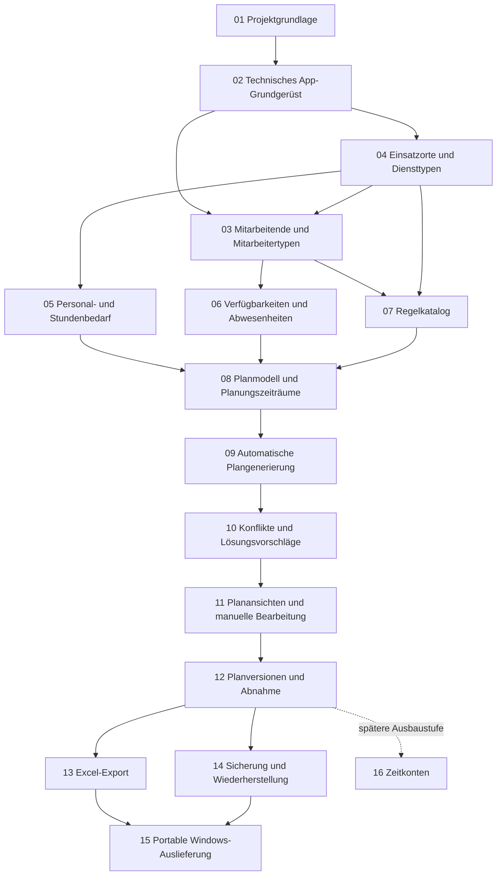

# Master-Roadmap der Salztal-Dienstplanung

Status: Grundfassung abgenommen am 2026-09-13; Systeme 05 und 06 abgeschlossen

Stand: 2026-09-15

## Zweck

Diese Master-Roadmap zeigt die geplanten Systeme der Anwendung, ihre grobe Reihenfolge und ihre wichtigsten Abhängigkeiten. Sie dient der Orientierung und ist keine Umsetzungsfreigabe.

Vor jedem System wird eine eigene kleinschrittige Teil-Roadmap unter `docs/roadmaps` erstellt und abgenommen. Erst danach darf dessen erster Implementierungsschritt beginnen. Technische Einzelheiten und konkrete Fachregeln gehören in diese späteren Teil-Roadmaps, nicht in die Master-Roadmap.

## Verbindliche Grundlagen

- Die fachlichen Grundlagen stehen in `GRUNDLAGEN_FRAGEN_UND_ENTSCHEIDUNGEN.md`.
- Die technischen Grenzen stehen in `ARCHITECTURE.md`.
- Die Qualitätsregeln stehen in `CLEANCODE.md`.
- Die Arbeits- und Abnahmeregeln stehen in `AGENTS.md`.
- Die abgeschlossene Projektgrundlage ist in `docs/roadmaps/completed/PROJECT_FOUNDATION_ROADMAP.md` dokumentiert.
- Konkrete Mitarbeiter-, Dienst-, Bedarfs- und Planungsregeln werden erst in den dafür vorgesehenen Teil-Roadmaps gemeinsam festgelegt.

## Statuszeichen

- `[ ]` noch nicht begonnen
- `[~]` in Bearbeitung oder wartet auf Abnahme
- `[x]` geprüft und ausdrücklich abgenommen
- `[!]` blockiert; der konkrete Grund wird direkt genannt

Ein System wird in dieser Übersicht erst als `[x]` markiert, wenn seine Teil-Roadmap vollständig abgeschlossen und abgenommen wurde.

## Grobe Abhängigkeiten

Der Pfeil zeigt eine notwendige Vorarbeit, aber nicht automatisch eine vollständige zeitliche Sperre. Eine Teil-Roadmap darf vorbereitende Arbeiten anders ordnen, wenn sie die Architekturgrenzen wahrt und die Abweichung begründet abgenommen wird.

## Geplante Systeme

### 01 – Projektgrundlage

Status: `[x]` – abgeschlossen und archiviert am 2026-09-13

Ziel: Fachliche Grundlagen, Architektur, Qualitäts- und Arbeitsregeln sowie wahrheitsgemäße Projektsteuerung fertigstellen.

Teil-Roadmap: `docs/roadmaps/completed/PROJECT_FOUNDATION_ROADMAP.md`

Abhängigkeiten: keine

### 02 – Technisches App-Grundgerüst

Status: `[x]` – abgeschlossen und archiviert am 2026-09-13

Ziel: Die leere Windows-11-Anwendung, Projektmodule, Abhängigkeitsgrenzen, zentrale Paketverwaltung und erste Architekturtests als belastbares Gerüst anlegen.

Teil-Roadmap: `docs/roadmaps/completed/TECHNICAL_APP_SCAFFOLD_ROADMAP.md`

Abhängigkeiten: 01

### 03 – Mitarbeitende, Mitarbeitertypen und Einsatzfreigaben

Status: `[x]` – abgeschlossen und archiviert am 2026-09-14

Ziel: Mitarbeitende mit getrennten Namen, Aktivstatus und genau einem gemeinsam referenzierten Mitarbeitertyp erfassen und lokal speichern. Jeder Typ stellt sein Wochen-Soll sowie reguläre, kontextabhängige und nur vorschlagsfähige Einsatzfreigaben als strukturierte Fachwerte bereit.

Teil-Roadmap: `docs/roadmaps/completed/EMPLOYEES_EMPLOYEE_TYPES_SHIFT_ELIGIBILITY_ROADMAP.md`

Nachtrag: Vor System 06 erweitert dessen abgenommener Vorbereitungsteil die bereits technisch vorbereitete Mitarbeitertypenpflege um drei weitere Starttypen, den `U`-/`K`-Tageswert sowie Anlegen, Bearbeiten und referenzgeschütztes Löschen in einem eigenen Tab. Der historische Abschluss von System 03 bleibt unverändert.

Abhängigkeiten: 02 und 04

### 04 – Einsatzorte, Diensttypen und Doppeldienste

Status: `[x]` – abgeschlossen und archiviert am 2026-09-13

Ziel: Erweiterbare Einsatzorte, normale Diensttypen mit bearbeitbaren Standardzeiten sowie die zusammengesetzten Einsatzmuster für den festen Restaurant-Doppeldienst `D` und den samstäglichen Springer `Spr` als fachliche Grundlage verwalten können.

Teil-Roadmap: `docs/roadmaps/completed/WORK_LOCATIONS_SHIFT_TYPES_SPLIT_SHIFTS_ROADMAP.md`

Abhängigkeiten: 02

### 05 – Personal-, Schicht- und Stundenbedarf

Status: `[x]` – abgeschlossen und archiviert am 2026-09-15

Ziel: Standardbedarfe und datumsbezogene Ausnahmen je Einsatzort und genau einem verlangten Diensttyp mit tatsächlicher Zeit und Personenzahl erfassen; daraus Personen- und Stundenbedarf nachvollziehbar berechnen.

Teil-Roadmap: `docs/roadmaps/completed/STAFFING_DEMAND_ROADMAP.md`

Abhängigkeiten: 04

### 06 – Verfügbarkeiten und Abwesenheiten

Status: `[x]` – vollständig geprüft, ausdrücklich abgenommen und archiviert

Ziel: Vorbereitend Mitarbeitertypen einschließlich Abwesenheits-Tageswert und Einsatzberechtigungen pflegen; anschließend Urlaub `U`, Krankheit `K` und verbindliche rote `X` für konkrete Kalendertage in einer Drei-Wochen-Ansicht erfassen, korrigieren und lokal speichern. Fortbildung, Wunschfrei und zeitliche Einschränkungen gehören nicht zur ersten Fassung.

Teil-Roadmap: `docs/roadmaps/completed/AVAILABILITY_ABSENCE_ROADMAP.md`

Abhängigkeiten: 03

### 07 – Regelkatalog und Prioritäten

Status: `[ ]`

Ziel: Gemeinsam bestätigte zwingende Regeln und weiche Regeln mit den Prioritäten hoch, mittel und niedrig als eine zentrale fachliche Quelle abbilden. Dazu gehören der normale Wochenkorridor, die nachgelagerte AH-Planung, höchstens zwölf AH-Stunden sowie Berichtsschwellen unter sechs und über zehn Stunden.

Teil-Roadmap: vor Beginn anzulegen und abzunehmen

Abhängigkeiten: 03 und 04; konkrete Regeln müssen fachlich bestätigt sein

### 08 – Planmodell und Planungszeiträume

Status: `[ ]`

Ziel: Planungswochen von Montag bis Sonntag, mehrwöchige Zeiträume, tatsächliche Dienstzeiten, Zuweisungen, vollständig oder teilweise ungedeckten Bedarf und einzelne Sperren fachlich und lokal speicherbar machen. Vorgetragene Typ1-Früh- und Spätdienste können strukturiert als bedarfsneutrale Bürozeit gekennzeichnet werden.

Teil-Roadmap: vor Beginn anzulegen und abzunehmen

Abhängigkeiten: 05, 06 und 07

### 09 – Automatische Plangenerierung

Status: `[ ]`

Ziel: Aus den bestätigten Eingaben einen zulässigen bestmöglichen Plan erzeugen, zwingende Regeln unverletzt lassen, Überbesetzung verhindern und ungedeckte Zeiträume sichtbar offenlassen. Zuerst werden Nicht-AH-Typen geplant; AH füllt danach nur verbleibende zulässige Lücken und verdrängt keine bereits geplante Person. Der samstägliche Springer darf nur als Notfall verwendet werden und verdeckt keine Teilunterdeckung vor seinem tatsächlichen Restaurantbeginn. Nur eine ausdrücklich gestartete Neugenerierung darf nicht gesperrte Zuweisungen neu verteilen.

Teil-Roadmap: vor Beginn anzulegen und abzunehmen

Abhängigkeiten: 08

### 10 – Konflikterklärung und Lösungsvorschläge

Status: `[ ]`

Ziel: Vollständig oder teilweise ungedeckte Bedarfszeiträume und verletzte weiche Regeln mit Ursache, Priorität und hilfreichen, nicht automatisch ausgeführten Lösungsmöglichkeiten verständlich erklären.

Teil-Roadmap: vor Beginn anzulegen und abzunehmen

Abhängigkeiten: 07 und 09

### 11 – Planansichten, manuelle Bearbeitung und Sperren

Status: `[ ]`

Ziel: Mitarbeitende als Zeilen und Tage als Spalten sowie eine Einsatzortansicht bereitstellen; Pläne bewusst manuell ändern, einzelne Zuweisungen sperren, prüfen und speichern, ohne eine automatische Neugenerierung auszulösen. Bewusst erlaubte manuelle Regelabweichungen bleiben sichtbar.

Teil-Roadmap: vor Beginn anzulegen und abzunehmen

Abhängigkeiten: 08 und 10

### 12 – Planhistorie, Versionen und Abnahme

Status: `[ ]`

Ziel: Pläne bewusst abnehmen, bei jeder Abnahme eine unveränderliche Version erhalten, ältere Fassungen ansehen oder wiederherstellen und geänderte Pläne erneut abnehmen. Ältere Pläne bleiben zunächst archiviert und werden nicht automatisch gelöscht.

Teil-Roadmap: vor Beginn anzulegen und abzunehmen

Abhängigkeiten: 11

### 13 – Excel-Export nach Vorlage

Status: `[ ]`

Ziel: Ausschließlich abgenommene Pläne in eine Kopie der bereitgestellten Excel-Vorlage exportieren und drei Wochen exakt wie vorgegeben auf einer Seite darstellen.

Teil-Roadmap: erst nach Bereitstellung und Untersuchung der echten Vorlage anzulegen

Abhängigkeiten: 12 und bereitgestellte Excel-Vorlage

Offenes Gate: Die endgültige Excel-Bibliothek kann erst nach dem Vorlagentest bestätigt werden.

### 14 – Lokale Datensicherung und Wiederherstellung

Status: `[ ]`

Ziel: Alle lokalen Anwendungsdaten manuell und regelmäßig automatisch sichern sowie kontrolliert wiederherstellen können.

Teil-Roadmap: vor Beginn anzulegen und abzunehmen

Abhängigkeiten: das lokale Datenmodell der Systeme 03 bis 12 muss ausreichend stabil sein

### 15 – Portable Windows-Auslieferung und Endabnahme der Kernversion

Status: `[ ]`

Ziel: Eine selbstständige `win-x64`-Ausgabe als entpackbaren Ordner erstellen, auf einem geeigneten Windows-11-System prüfen und die fachliche Kernversion abnehmen.

Teil-Roadmap: vor Beginn anzulegen und abzunehmen

Abhängigkeiten: 02 bis 14; System 16 ist ausdrücklich keine Voraussetzung

Offene Gates: Visual-C++-Laufzeitvoraussetzung, portable Startfähigkeit, Klinikrechner-Test und fachliche Endabnahme.

### 16 – Zeitkonten als spätere Ausbaustufe

Status: `[ ]` – nachrangig

Ziel: Über- und Minusstunden aus geplanten Diensten fortschreiben, Änderungen laufender Pläne berücksichtigen und begründbare manuelle Korrekturen ermöglichen.

Teil-Roadmap: erst nach gesonderter Freigabe anzulegen

Abhängigkeiten: 12; darf die erste nutzbare Kernversion und System 15 nicht blockieren

## Orientierungspunkte

### Grundlage bereit

Systeme 01 und 02 sind abgenommen. Das Projekt besitzt dann verbindliche Regeln und ein kompilierbares, aber noch fachlich leeres App-Gerüst.

### Planungsdaten vollständig erfassbar

Systeme 03 bis 08 sind abgenommen. Alle für eine Planberechnung notwendigen bestätigten Daten können dann erfasst und geprüft werden; daraus folgt noch nicht, dass bereits automatisch geplant werden kann.

### Planerstellung fachlich nutzbar

Systeme 09 bis 12 sind abgenommen. Ein Plan kann dann erzeugt, erklärt, manuell bearbeitet, versioniert und abgenommen werden.

### Kernversion auslieferbar

Systeme 13 bis 15 sind abgenommen. Export, Sicherung und portable Windows-Ausgabe wurden dann separat geprüft. Erst die noch festzulegende Endabnahme bestätigt die tatsächliche Einsatzbereitschaft.

### Spätere Erweiterung

System 16 ergänzt Zeitkonten nach gesonderter Priorisierung, ohne den Abschluss der Kernversion aufzuhalten.

## Steuerungsregeln

- Diese Reihenfolge ist die aktuelle Orientierung und keine pauschale Freigabe aller Systeme.
- Vor jedem System wird genau eine eigene aktive Teil-Roadmap erstellt, geprüft und abgenommen.
- Jede Teil-Roadmap zerlegt ihr System in minimale einzeln abnehmbare Schritte.
- Ein neues System beginnt erst, wenn seine notwendigen Abhängigkeiten tatsächlich erfüllt sind.
- Werden Systeme geteilt, zusammengelegt oder neu geordnet, werden Begründung, Abhängigkeiten und betroffene Dokumente gemeinsam aktualisiert.
- Noch offene Fachregeln werden nicht erfunden und blockieren nur den Teil, der sie wirklich benötigt.
- Fehlende frühere Planwochen dürfen die spätere Generierung nicht blockieren.
- Zeitkonten bleiben nachrangig.
- App-Code, Pakete oder Datenbankstrukturen werden durch dieses Dokument nicht freigegeben oder erzeugt.

## Vorgemerkte Wartungsmaßnahmen

- Der historisch eng benannte `ServiceCatalogDbContext` ist seit MA-07 der einzige Context der gemeinsamen lokalen Anwendungsdatenbank. Eine spätere Umbenennung ist nur in einem eigenen abgenommenen Wartungs- und Migrationsschritt zulässig. Dieser Schritt muss vorhandene Datenbanken vom veröffentlichten System-04-Stand und vom dann aktuellen Stand nachweislich aktualisieren können, ohne Migrationshistorie oder Daten zu verlieren. Bis dahin werden alle Schemaänderungen bewusst in derselben Context- und Migrationsfolge fortgeführt.

## Nächster übergeordneter Schritt

System 06 ist fachlich, technisch und sichtbar vollständig geprüft, ausdrücklich abgenommen und archiviert. Der Gesamtnachweis bestätigt 495 Tests, einen Build ohne Warnungen oder Fehler, den aktuellen Migrationsstand, die Architekturgrenzen und die Repository-Hygiene. Für System 07 besteht bereits eine aktive Fragensammlung; sie ist noch keine Teil-Roadmap und gibt keine Implementierung frei.
